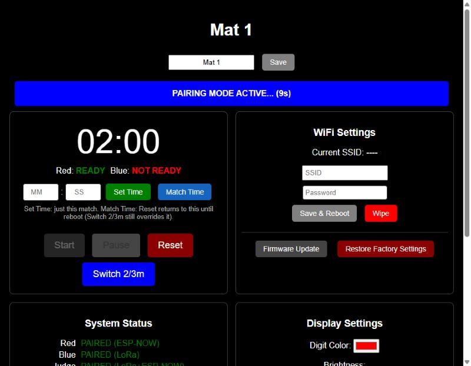
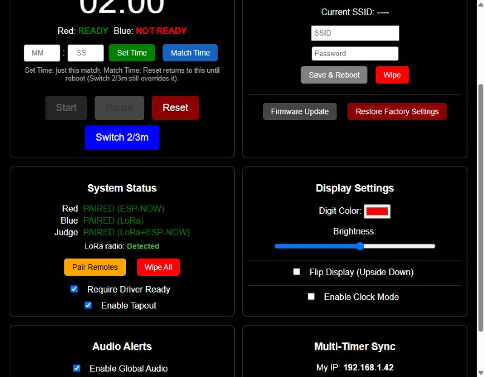

# ⏱️ Event Match Timer & Lockout System

An open-source, ESP32-based event and match timer platform featuring wireless remote integration, with web interface.

---

## 🚀 Getting Started

### 1. Hardware Orientation & Powering
* **Orientation Flexibility:** The timer can be configured to operate in either horizontal orientation. If your mounting or power cable strategy requires it, you can flip the included hanging bracket to the opposite side and enable **Invert Display** in the web settings to route the power cable from above.
* **Power Requirements:** Connect the timer using the provided power supply. 
> ⚠️ **CRITICAL:** Only use **5V** power supplies capable of delivering at least **60W**. Applying a voltage higher than 5V will **permanently damage** the hardware.

### 2. Initial Wi-Fi & Web UI Setup
1. **Boot Sequence:** Upon power-up, the display initializes with dashes (`--:--`) and the border will blink, indicating it is attempting to connect to the last saved Wi-Fi network.
2. **Access Point (AP) Mode:** If the network is unavailable (or during first-time setup), the timer switches to AP mode, broadcasting its own network:
   * **SSID:** `TimerSetup`
   * **Password:** `12345678`
3. **Connecting to the UI:** * Connect your phone, tablet, or computer to the `TimerSetup` network.
   * Locate the timer's IP address in your device's network connection settings (this process varies by operating system).
   * Open a web browser and enter the IP address to access the control interface.

  

*Note: The local AP interface is identical to the network interface. If no external Wi-Fi network is available at your venue, you can run the timer in this standalone mode completely offline.*

4. **Station Mode (Optional):** To connect the timer to an existing venue Wi-Fi network, use the configuration section at the bottom of the webpage to save your local **SSID** and **Password**.

  

---

## ⚙️ Configuration & Features

### 🎮 Wireless Remotes & Pairing
The system supports three battery-powered wireless remotes: **one Main Controller** and **two Driver Ready/Tap-Out buttons** (Red vs. Blue).

  

* **Pairing Procedure:** Remotes must be paired before deployment. Click **Pair Remote** in the Web UI to enter binding mode, turn on the remote, and press any button. The timer will automatically exit binding mode, and the Web UI status will update to `Paired`.  Repeat independently for each remote.
  * *Pairing Timeout:* Binding mode automatically cancels itself after 15 seconds if no remote responds (with a live countdown shown on screen), rather than hanging indefinitely until a reboot.
* **Driver Ready Lockout:** Enabling the `Require Driver Ready` checkbox prevents a match from starting until both driver remotes register a "Ready" state - the **Start** button itself grays out while waiting, and the ready state for each side is shown directly under the countdown.
  * *Visual Indicators:* The physical white border indicates overall readiness. Individual Red/Blue illumination confirms when each respective driver has ready-ed up.
* **Tap-Out Functionality:** Even if the pre-match lockout is disabled, the driver remotes function by default as tap-out indicators. Pressing them during a match triggers a unique tap-out animation and audio effect (can be toggled off via the checkbox).

  

### 📻 ESP-NOW and LoRa Remotes, Side by Side
Newer timer boards carry an onboard LoRa radio alongside the original ESP-NOW remote support - both run **at the same time, in the same firmware image**. That means a single timer can have, say, Red paired to an older ESP-NOW remote while Blue and Judge are paired to newer LoRa remotes, so a LoRa-capable board can go into service before every remote in the field is replaced.

* **Per-Role Binding:** Each of Red, Blue, and Judge is paired independently, and the System Status panel shows exactly which radio each one is bound through - `PAIRED (ESP-NOW)`, `PAIRED (LoRa)`, or `PAIRED (LoRa+ESP-NOW)` if the same role has been bound on both.
* **Automatic Hardware Detection:** On boards without the LoRa radio installed, the firmware detects its absence at boot (shown as `LoRa radio: Not detected`) and simply runs ESP-NOW only, rather than wasting startup time retrying a radio that isn't there.

  

### 🔗 Multi-Timer Sync (Web-Based)
Running several mats off one set of remotes already works by pairing the same remote to each timer directly (above) - but for anything triggered from the **web page** (start/pause/reset, time-select, colors, brightness, audio, ready/tapout settings), pair two timers together over WiFi so clicking a button on one applies to both.

* **Setup:** Open the **Multi-Timer Sync** panel, enter the other timer's local IP address (shown on its own page as `My IP`), and click **Sync**. Everything that timer currently has configured pushes over immediately, so both units start in agreement instead of drifting until the next change.
* **What Syncs:** Match control, match time, display color/brightness/flip, audio settings, ready-required, tap-out, and clock mode. Remote button presses are *not* relayed this way - they already reach every timer that remote is directly paired to, with no extra setup needed.
* **One-Directional by Default:** Sync only pushes outward from whichever timer's web page you clicked on - pair both timers to each other's IP if you want either one to be able to drive the other.
* **Naming Timers:** Give each unit a short label (e.g. "Mat 1") at the top of its page - shown in the browser tab too - so it's obvious which page you're looking at when several are open side by side.

### ⏱️ Match Time vs. Set Time
Two different buttons next to the manual MM:SS entry handle two different needs:

* **Set Time:** A one-off override for just the upcoming match. Pressing **Reset** afterward falls back to whatever the standing default already was (the 2/3-minute preset, or a previously-set Match Time).
* **Match Time:** Sets a new standing default - **Reset** keeps returning to this duration until the unit reboots (it isn't saved permanently, so a custom one-off event length doesn't silently become the new default forever). The **Switch 2/3m** button still overrides it either way.

### 🕐 Clock Mode
Toggle **Enable Clock Mode** (in Display Settings) to repurpose the digit display as a wall clock when the timer is idle between matches. The web page itself keeps showing whatever match time was last active (dimmed, since it isn't live) - the physical display is what shows the actual time.

### 🔊 Audio Options
* **Global Toggle:** Easily enable or disable all system audio via the web panel.
* **Output Routing:** Switch between the onboard piezo beeper or a dedicated **relay output** used to switch larger external horn circuits, PA systems, or specialized lighting.
* **Attention Horn:** The Main Controller features a dedicated button to manually trigger the sound effects to grab the attention of competitors or spectators.

### 🔒 Operational Lockout
To prevent accidental mid-match disruption, most configuration options, adjustments, and web buttons are **automatically disabled** while the timer is actively running.

---

## 🛠️ Assembly Process (Electronics Kits)

For users assembling the hardware from the DIY electronics kits, follow this general framework. Refer to the project `BOM.md` for exact hardware sizing, screw counts, and component sourcing links.

### 1. 3D Printed Frame Selection
Choose the frame variant that best fits your 3D printer's build volume:
* **Small Printers:** Cut down to fit standard build plates. Requires more assembly hardware and time but maximizes accessibility.
* **Medium Printers (H2s/H2d Optimized):** A balanced approach featuring lower part counts and optimized print times.
* **Large Printers:** Designed specifically for large-format platforms like the *Elegoo Orange Storm Giga*. 

### 2. Print Settings & Materials
* **Main Frame:** Print in **PETG** for superior mechanical strength and thermal resilience during high-temperature transport or storage.
  * **Walls:** 4–6 perimeters
  * **Infill:** 15–25% Gyroid
* **Lenses:** All frame variations share the same lens files. Print them with enough top/bottom layers to ensure the front face prints **completely solid** to optimize light diffusion and visual clarity.

---

## 🧠 Advanced Development & Limitations

### 📡 RF Limitations & Best Practices
The timer utilizes an **ESP32** module with a printed trace antenna; remotes utilize **ESP8266** modules over ESP-NOW, or on newer timer boards, dedicated **LoRa** radios (see [ESP-NOW and LoRa Remotes, Side by Side](#-esp-now-and-lora-remotes-side-by-side) above) - both with printed antennas.
* **Range & Interference:** While highly reliable in tested arena layouts (e.g., SEMO), performance can degrade at extreme distances or in environments experiencing heavy 2.4 GHz spectrum congestion (crowded Wi-Fi, heavy radio traffic).
* **Upgrades:** If your venue demands extreme range, the hardware can be modified to use variants featuring external SMA antennas. Reach out if you need assistance engineering a solution.
* **Running Multiple Timers:** Pair a single set of remotes to multiple timers by repeating the pairing process on each one (above), and/or bind timers to each other for web-triggered actions - see [Multi-Timer Sync](#-multi-timer-sync-web-based) above.

### 💻 Firmware Upgrades & Exposed I/O
* **Over-The-Air (OTA) Updates:** Firmware updates can be flashed seamlessly without opening the enclosure. Navigate to `http://<your-timer-ip>/update` to access the **ElegantOTA** interface, where you can drag-and-drop compiled `.bin` updates.
* **Restore Factory Settings:** A dedicated button wipes all remotes, WiFi credentials, sync target, and display/audio settings in one step, then reboots - useful for repurposing a unit or ruling out a stale setting during troubleshooting. WiFi credentials alone can also be wiped independently (`Wipe`, next to Save & Reboot) without touching anything else.
* **Hardware Expansion:** Additional I/O pins are deliberately exposed near the internal ESP32 module. Advanced users can open the case and solder directly to these lines to integrate custom addressable LED strips, sensors, or physical inputs.

### ⚡ ESD Precautions & LED Repair
> ⚡ **CAUTION:** The internal PCBs contain components sensitive to Electrostatic Discharge (ESD). Handle bare board assemblies with care during assembly or modifications.

* **Common Failure Mode:** If an ESD event occurs, a single addressable LED in the display chain may burn out. Because the LEDs are wired in series, **if one LED fails, all subsequent data down the chain is blocked**, causing the rest of the display past that point to drop out. 
* **Support:** If you experience an LED failure during assembly or firmware hacking, reach out—these are repairable, and I can guide you through jumping or replacing the compromised pixel. Note that failures have only occurred during loose bench development; fully enclosed units have proven resilient during regular live event usage.